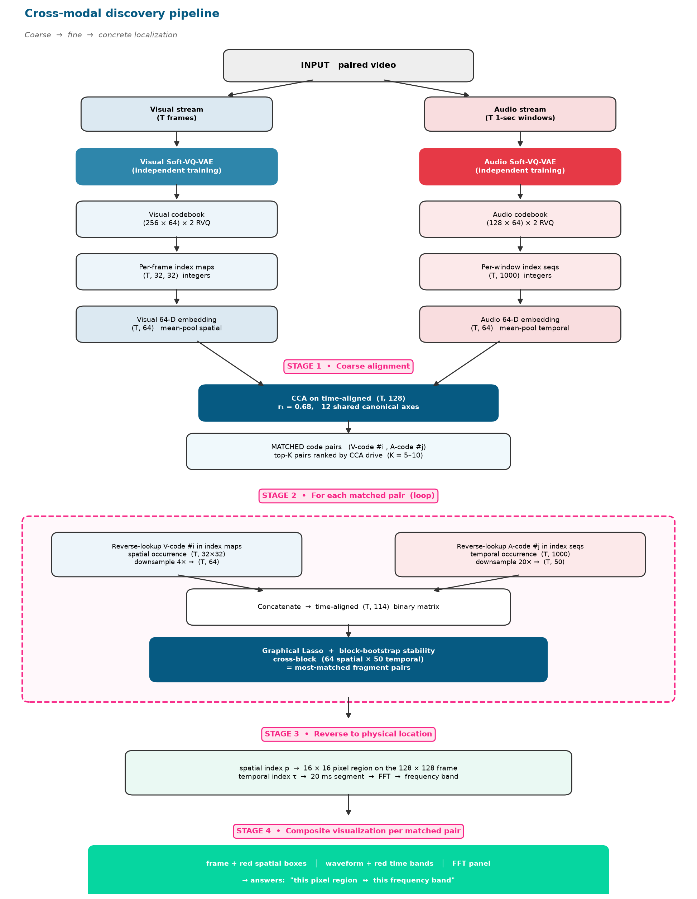

# Unsupervised Cross-Modal Representation Learning and Relationship Discovery

Can relationships between different kinds of data be discovered without labels, from how the streams co-occur over time? This repository contains a pipeline that tokenizes each data stream independently and then recovers cross-modal correspondences statistically. The first testbed is video with audio.

**Author:** Jia (James) Li, M.S. Electrical Engineering, Northwestern University
**Advisor:** Prof. Naichen Shi (Northwestern IEMS)



## Method

1. **Tokenize.** A Soft-VQ-VAE with residual vector quantization learns a discrete codebook for each modality independently (images: 256 codes x 2 levels; audio: 128 codes x 2 levels). No cross-modal signal is used during training.
2. **Match.** Canonical Correlation Analysis (CCA) on mean-pooled 64-D code embeddings finds which visual codes co-vary with which audio codes.
3. **Localize.** For each CCA-matched pair, Graphical Lasso on a spatial-temporal occurrence matrix (64 image regions x 50 audio segments) estimates which image region is directly related to which audio segment.
4. **Validate.** A per-frame metric measures how many Graphical Lasso edges are actually observed together in individual frames.

## Results so far

- **Tokenization:** 38x compression on AFHQ images and 25.6x on LJSpeech audio with no codebook collapse.
- **Graphical Lasso alone fails; CCA succeeds.** On 9 minutes of anime (2,169 aligned one-second bins), Graphical Lasso on token statistics found no stable cross-modal edges (max |partial correlation| about 0.04). CCA recovered strong shared structure (first canonical correlation 0.68, mean 0.52 over the top 12 components) and supports audio-to-video retrieval above chance.
- **Two-stage localization:** 11 of 20 matched pairs produce localized edges; the best pairs reach 75% per-frame validation (mean 43%).

## Repository layout

All scripts are in `src/` and are grouped below by stage.

| Stage | Scripts |
|---|---|
| Tokenizer models and training | `vqvae_model.py`, `vqvae_audio.py`, `train_afhq.py`, `train_ljspeech.py`, `train_visual_vqvae.py`, `train_audio_vqvae.py`, `verify_vqvae.py` |
| Residual VQ and token extraction | `rvq.py`, `vqvae_rvq_models.py`, `train_rvq.py`, `extract_media.py`, `extract_tokens.py`, `extract_tokens_rvq.py` |
| Graphical Lasso on token statistics (early attempts) | `glasso_cross_modal.py`, `glasso_cross_modal_v2.py`, `glasso_universal.py` to `glasso_universal_v4.py`, `glasso_final_graph.py`, `interpret_edges.py` |
| Embeddings and CCA | `embedding_analysis.py`, `dominant_code_analysis.py`, `cca_final_graph.py`, `cca_graph_topk.py`, `cca_cross_retrieval.py`, `cca_metrics.py` |
| Two-stage pipeline and validation | `pipeline_full.py`, `pipeline_enhanced.py`, `pipeline_glasso_v2.py` to `pipeline_glasso_v5.py`, `build_index.py`, `draw_pipeline.py` |

`slurm/` holds job scripts for Northwestern's Quest cluster; replace `<ALLOCATION>` and `<NETID>` with your own.

## Running

```bash
pip install -r requirements.txt
export MMVQ_ROOT=/path/to/project_data   # folder containing data/, tokens_rvq/, models_rvq/, results/
python src/pipeline_full.py
python src/pipeline_glasso_v2.py
```

Scripts read and write relative to `MMVQ_ROOT` (default: the current directory).

## Data

The video, extracted frames, audio, trained checkpoints, and generated results are not included. The test video is copyrighted anime footage and cannot be redistributed; AFHQ and LJSpeech are available from their original sources.

## Known issues

- Visualizations in `pipeline_glasso_v3.py` to `pipeline_glasso_v5.py` draw image boxes without the center-crop offset used during tokenization (fixed in `pipeline_glasso_v2.py`). Numerical results are unaffected.
- Some matches can be driven by on-screen text overlays in the compilation video; masking overlays is planned.
